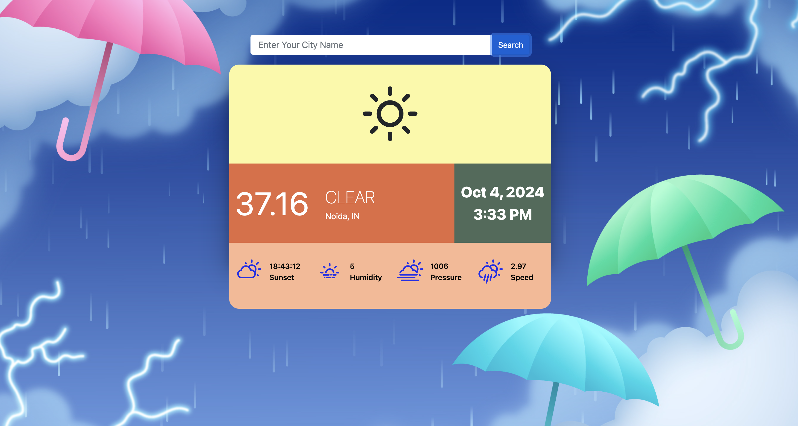
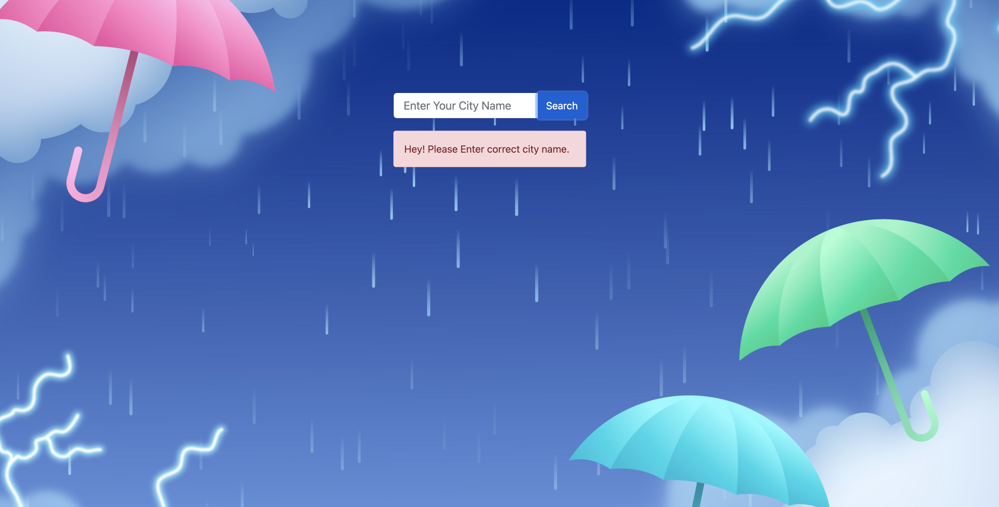

# Whether Status Web App

It will show the current whether status in real time data. 




## Table of Contents

- [Introduction](#introduction)
- [Features](#features)
- [Installation](#installation)
- [Usage](#usage)

## Introduction

WhetherStatus Web App is a simple web application built with React and Reactstrap that allows users to get the whether status. The app uses an external API to populate the temparute, wind speed and presents them in an attractive layout.

This project was created as a learning exercise to demonstrate the integration of React, Reactstrap, and external APIs in a web application context.

## Features

- Generate and display whether status based on user entered city.
- Responsive and user-friendly interface using Reactstrap components.
- Real-time updates upon search term changes.

## Installation

To run the ImageGen Web App locally, make sure you have Node.js and npm installed. Then follow these steps:

1. Clone the repository:
   ```bash
   git clone git@github.com:Adarsh-044/weatherStatus.git


2. npm install 
3. npm start


## Deployment

I have used netlify for the purpose of deployment 

## Production Link : https://whether-status.netlify.app/